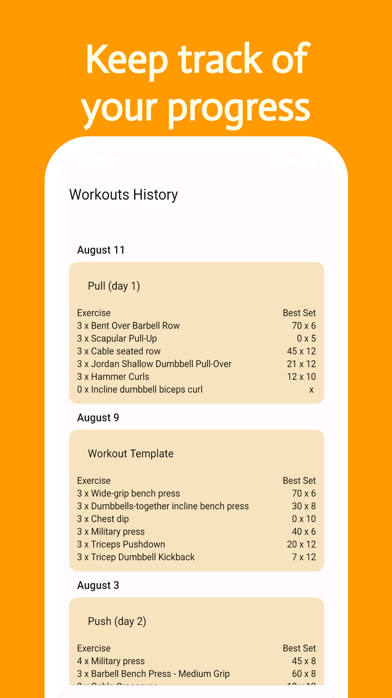

# Active App

    

## to-do for v1 (subject to changes)

- [ ] Exercises

  - [ ] Dataset
    - [ ] Better exercise dataset
    - [ ] Images (optional)
  - [x] Rep based exercises
  - [ ] Time based exercises
  - [x] Widgets
    - [x] By volume
    - [x] By ORM
    - [ ] By time

- [ ] Workouts

  - [x] Create workout
  - [ ] Edit workout
  - [x] Workout history
  - [x] Daily Check
  - [ ] Calendar
    - [x] Current week calendar
    - [ ] Full calendar

- [ ] Account

  - [ ] Connct Google account
  - [ ] Profile edit

- [ ] Utils

  - [x] Themes
    - [x] Light
    - [x] Dark
    - [x] System
    - [x] Material you

## Screenshots

